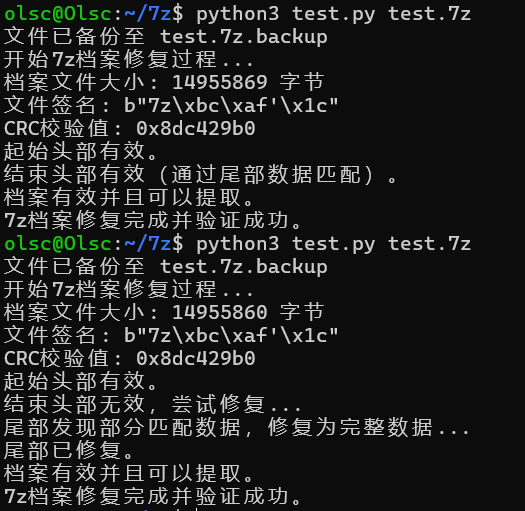

# 简易7z修复工具
在`Ubuntu 20.04`上测试成功。<br>
只测试了在`2345好压`的7z文件上进行修复。<br>
通过`python3 test.py + 7z文件名`进行修复。<br>
修复能力非常有限，7z的修复是一项非常艰巨的任务，简单的脚本很难完成。<br>

# Simple 7z Repair Tool  
Tested successfully on `Ubuntu 20.04`.  
Only tested on 7z files from `2345 HaoZip` for repair.  
Repair can be done by running `python3 test.py + 7z filename`.  
The repair ability is very limited. Repairing 7z files is a very challenging task, and simple scripts are not capable of completing it effectively.  

# 簡易7z修復ツール  
`Ubuntu 20.04`で正常に動作確認済み。  
`2345好压`の7zファイルでのみ修復をテストしました。  
修復は`python3 test.py + 7zファイル名`を実行することで行えます。  
修復能力は非常に限定的です。7zファイルの修復は非常に困難な作業であり、簡単なスクリプトでは完全に修復することは難しいです。

```
sudo apt install p7zip-full
```

